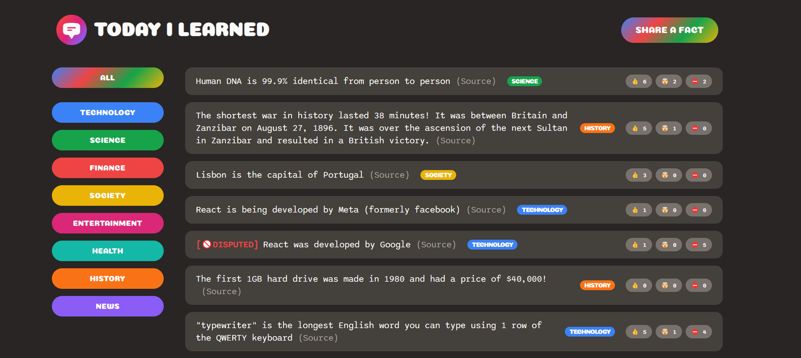

# Facts-Adding Website with React and Supabase Database API

## 🔰Introduction

This is a web application that allows users to add facts on various categories. The application was built using React and Supabase Database API. Users can add facts and provide a trustworthy source link to support their claims. Other users can vote or downvote these facts. If downvotes are greater than upvotes, the fact is marked as disputed.

⏭️Visit the [Facts-Adding Website](https://msb-factsapp.netlify.app/) to learn more.

## 🔰Features

<ul>
  <li>Users can add facts on various categories.</li>
  <li>Users have to provide a trustworthy source link to support their claims.</li>
  <li>Other users can vote or downvote these facts.</li>
  <li>If downvotes are greater than upvotes, the fact is marked as disputed.</li>
</ul>

## 🔰Technologies Used

- [React](https://reactjs.org/docs/getting-started.html)
- [Supabase Database API](https://supabase.io/docs)

## 🔰Installation

<ol>
  <li>Clone the repository</li>
  <li>Install dependencies</li>
  <li>Start the development server</li>
</ol>

<pre><code>git clone https://github.com/kingmalitha/facts-adding-website.git
cd facts-adding-website
cd today-i-learned
npm install
npm start
</code></pre>

## 🔰Usage

<ol>
  <li>Visit the website</li>
  <li>Browse categories and facts</li>
  <li>Add facts with trustworthy source links</li>
  <li>Vote or downvote facts</li>
  <li>Mark disputed facts</li>
</ol>

## 🔰Screenshots

## 🔰Conclusion

This facts-adding website is a helpful tool for users who want to share information and facts about various topics. The use of React and Supabase Database API make it easy for users to interact with the website and add their own facts. With the ability to vote and downvote, users can also ensure that the information they are receiving is accurate and trustworthy.

